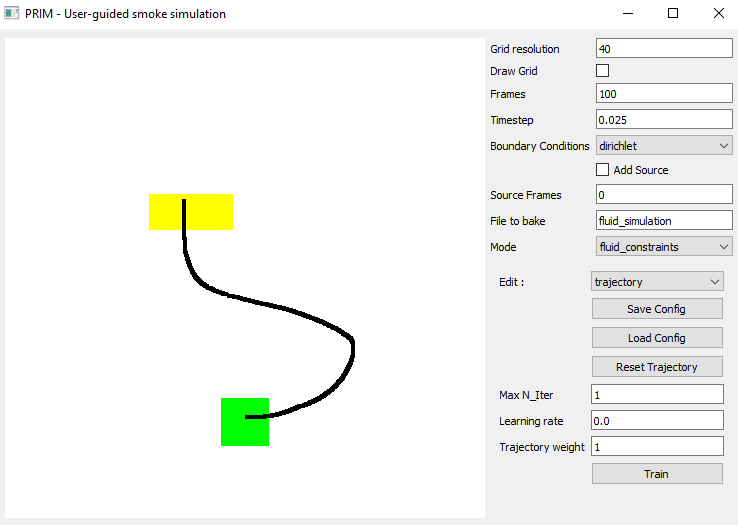
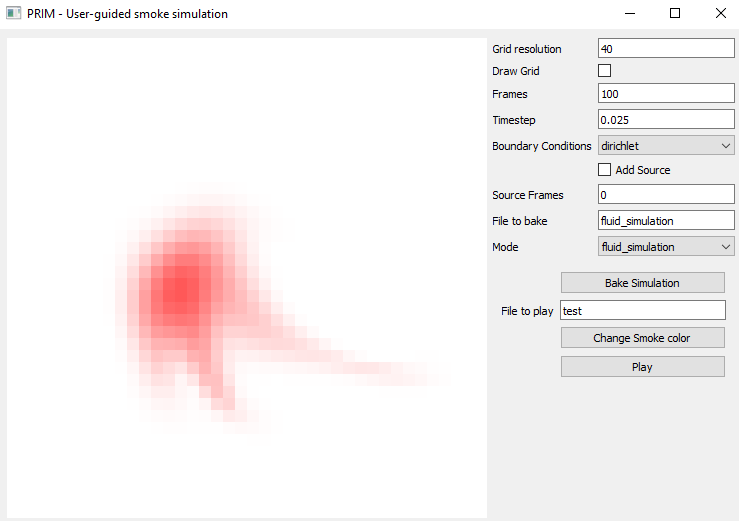

# Differential Stable Fluid Solver using TensorFlow
by Sammy Rasamimanana  
<i> This project was implemented as part of an IGR PRIM Project </i>

## Structure of the repo
`src` folder contains the code of the solver  
`output` folder contains the image/gif results of simulations  
`data` folder contains the saved configuration when using the constraints layer in the UI  
`bake` contains the data of the simulations results  
`utils` contains the code of the UI  

## Differentiable Stable Fluid solver
### Stable fluid solver
See `src/tf_solver_staggered.py`. For now, only the staggered grid version is up-to-date. 
There are some examples of how to use this solver in the files `src/vortex.py` and `src/buoyancy.py`

### Training
See `src/tf_train.py` for the optimization loop.  
An example of how to use it can be found in `src/training.py`

### User-guided smoke simulation
The User Interface is implemented using PyQt5. Run `utils/mainwindow.py` to start it.

## Progress

### Week 29/03
<li> Code optimization of the TensorFlow pipeline
<li> Rewrite boundary conditions on centered grid

### Week 05/04
<li> Adding intermediate velocity constraints
<li> Tests on some constraints

### Week 12/04
<li> Created basic UI to simplify tests
<li> Parsing file to .json format to make tests more organized
<li> Changing initial condition to be guided by the trajectory

### Week 12/04
<li> Change loss function using cosine loss
<li> Change initial guess
<li> Try training dt
<li> Add load function in UI

### Week 26/04
<li> Trying on larger grid
<li> Trying curl approach
<li> Trying vortex approach

### Week 15/05
<li> Tests with manually placed vortices
<li> Tests with adding vortices at specific frames 

### Week 22/05
<li> Rewrite using Staggered Grid
<li> Add BC variable (dirichlet or neumann)
<li> Forcing using LU decomposition to speed up (No Sparse Tensor solver yet in tf...)
<li> Training using Staggered Grid and neumann
<li> Project the initial velocity field 
<li> Rewrite loss function so that it uses only tensors

### Week 29/05
<li> Advanced UI using PyQt5
<li> Merge UI and fluid simulation 
<li> Merge UI and fluid constraint
<li> Renormalizing to avoid numerical diffusion

### Week 12/06
<li> Documentation

### Potential improvements
<li> Merge UI and animation layers
<li> Change the speed of the trajectory
<li> Import image as density
